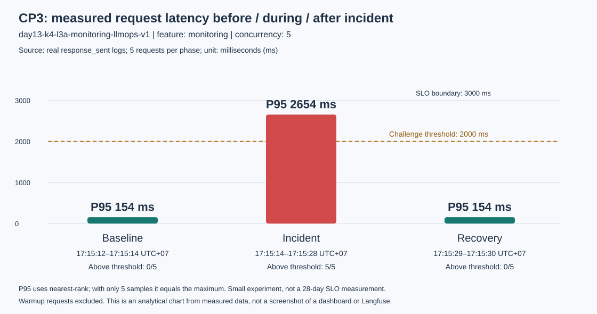

# Báo cáo cá nhân — K4-L3A Day 13 Monitoring & LLMOps

> Mỗi học viên hoàn thiện một file duy nhất này. Khi dẫn evidence, dùng đường dẫn tương đối, ví dụ `evidence/07-trace-waterfall.png`.

## 1. Thông tin học viên

- **Họ và tên:** Nguyễn Quốc Cường
- **MSSV:** 2A202602886
- **Lớp:** K4-L3A
- **Repository URL:** https://github.com/absolute-avatar/K4-L3-DAY13-NguyenQuocCuong-2A202602886-Monitoring-LLMOps
- **Commit SHA cuối:** TODO (CP4 - pending): điền tham chiếu commit nộp sau khi chốt evidence và push. HEAD tại lần kiểm tra tài liệu là `75c2812c6d4f61ae8c6a382d2f7e8f5ea6078cb8` (checkpoint 1), **không phải commit chứa toàn bộ CP2/CP3**. SHA dùng để chấm phải là commit đã có trên remote, được nộp trên LMS/Codelabs.
- **Challenge ID:** `day13-k4-l3a-monitoring-llmops-v1` (challenge chính thức K4-L3A đã được cung cấp).
- **Tên project Langfuse cá nhân:** `day13-k4-l3a-2A202602886`

## 2. Evidence index

Tests/validators có thể dùng output `.txt`; các mục UI dùng ảnh thật. Ảnh 08 và 14 hiện đã có file nhưng còn việc cần xử lý trước khi nộp.

| Evidence | Đường dẫn | Trạng thái |
|---|---|---|
| 01–03 — Tests/validators mới nhất | [Output kiểm tra 29/09/2026](evidence/pre-submission-validation.txt) | 41 passed; log 100/100; dashboard 6/6; chưa gắn với commit nộp cuối |
| Tests/validators lịch sử | [CP3](evidence/cp3-20260929T101509Z/validation.txt); CP2: [pytest](evidence/01-pytest.txt), [logs](evidence/02-log-validator.txt), [dashboard](evidence/03-dashboard-validator.txt) | Giữ nguyên snapshot cũ, không ghi đè kết quả lịch sử |
| 04 — Structured log | [Ảnh log](evidence/04-structured-log.png) | Đã có timestamp, event, correlation ID và metadata |
| 05 — PII redaction | [Input giả](evidence/05a-pii-test-input.png), [log đã che](evidence/05b-pii-redacted-log.png) | Đủ email, điện thoại Việt Nam, CCCD và thẻ |
| 06 — Trace list | [Danh sách traces](evidence/06-trace-list.png) | Tên project cá nhân và hơn 10 root traces |
| 07 — Trace waterfall | [Cây observations](evidence/07-trace-waterfall.png) | Đủ root/retrieval/generation và quan hệ cha–con; có thể bổ sung Timeline |
| 08 — Trace metadata | [Metadata](evidence/08a-trace-metadata.png), [generation usage](evidence/08b-generation-usage.png) | TODO: che giá trị public key trong cả hai ảnh trước khi nộp |
| 09 — Prompt versions | [Prompt v1/v2 và labels](evidence/09-prompt-versions.png) | Đã có baseline/production ở v1, candidate ở v2 |
| 10 — Prompt rollback | [Production v2](evidence/10a-production-v2.png), [rollback về v1](evidence/10b-production-v1-rollback.png) | Đã có ảnh trước/sau; trace IDs của lượt kiểm chứng ở mục 5 |
| 11 — Dashboard runtime | [Dashboard sáu panel](evidence/11-dashboard-overview.png) | Có dữ liệu, time range 60 phút, đơn vị và threshold |
| 12 — Incident metric | [Ảnh metric](evidence/12-incident-metric.png), [SVG](evidence/cp3-20260929T101509Z/12-incident-metric.svg), [số liệu gốc](evidence/cp3-20260929T101509Z/summary.json) | P95 baseline → incident → recovery và thời gian challenge |
| 13 — Incident log | [Ảnh log](evidence/13-incident-log.png), [5 response log gốc](evidence/cp3-20260929T101509Z/incident-responses.jsonl) | Có latency bất thường và `req-67ed9c57` |
| 14 — Incident trace | [Ảnh trace hiện có](evidence/14-incident-trace.png), [15 traces API đã xác minh](evidence/cp3-20260929T101509Z/langfuse-traces.json) | TODO: bật Show labels và bổ sung metadata correlation ID trên ảnh |

<!-- TODO (CP4 docs - completed): Dẫn đúng ảnh 05a/05b, 09, 10a/10b và 11–14;
giữ output cũ, bổ sung output kiểm tra mới, không dùng link tới file đã bị xóa.
TODO (CP4 UI - pending): Che public key trong 08a/08b; hoàn thiện ảnh 14.
TODO (CP4 Git/LMS - pending): Chốt commit, kiểm tra lại trên commit đó, push và nộp SHA. -->

## 3. Kết quả kỹ thuật

| Nội dung | Baseline | Kết quả cuối | Nhận xét |
|---|---|---|---|
| `validate_logs.py` | CP1: 100/100 | 100/100 ở lần kiểm tra mới nhất | 275 records, 125 correlation IDs, không phát hiện PII theo detector; snapshot CP3 trước đó là 271 records/123 IDs |
| `validate_dashboard.py` | Contract starter hợp lệ | 6/6 panel | Runtime dashboard đọc trực tiếp JSONL |
| `pytest` | 26 passed sau CP1 | 41 passed ở lần kiểm tra mới nhất | Có test tách latency xử lý/client, phân trang trace, giữ dữ liệu riêng tư và cleanup incident khi lỗi |
| Traces CP3 đã xác minh | Baseline: 5 traces | 15/15 measured traces, 45 observations | Ba phase đều có root/retrieval/generation qua Observations API v2; đây không phải tổng số traces trong project |
| PII trong log/raw trace I/O | Không dùng input cá nhân thật | Detector log: 0; raw I/O trong 45 observations CP3: không có | Detector chỉ kiểm tra các pattern đã biết, không phải bảo đảm tuyệt đối cho mọi loại PII |
| Latency P95 / TTFT P95 | CP3 warm baseline: 154 / 50 ms | Incident: 2654 / 50 ms; recovery: 154 / 50 ms | Cùng 5 queries chính thức, concurrency 5; lọc đúng correlation IDs của từng phase |
| Retrieval success rate | CP3 baseline: 100% | Incident và recovery: 100% | Sự cố retrieval chậm, không phải retrieval thất bại |

## 4. Logging và PII

- **Cách tạo/nhận và truyền correlation ID:** [middleware](../app/middleware.py) clear context cho từng request, dùng `x-request-id` nếu có hoặc sinh `req-<8-hex>`, bind vào context và trả lại response header. Cùng ID được truyền vào `LabAgent.run` và metadata Langfuse.
- **Các metadata được ghi vào structured log:** user ID đã hash, session, feature, model, env và correlation ID; response có latency, TTFT, tokens, cost, quality và tool success.
- **Cách bảo đảm PII được scrub trước khi ghi:** [logging processors](../app/logging_config.py) gọi scrubber trước JSONL writer/renderer; trace không capture raw input/output và preview qua `summarize_text`.
- **Cách kiểm chứng kết quả:** tests, validator độc lập, log runtime và trace API. CP3 đã xác minh toàn bộ 45 observations của 15 measured traces không có raw input/output; chỉ export metadata định lượng, không export query preview từ challenge riêng.
- **Evidence PII bổ sung:** hai request test giả dùng session `pii-evidence-b2a4e95b`, correlation IDs `req-d00827d9` và `req-713a03b1`. [Ảnh input](evidence/05a-pii-test-input.png) đánh dấu rõ `FAKE TEST INPUT ONLY`; [ảnh output log](evidence/05b-pii-redacted-log.png) có đủ `[REDACTED_EMAIL]`, `[REDACTED_PHONE_VN]`, `[REDACTED_CCCD]`, `[REDACTED_CREDIT_CARD]`. Tách hai request để preview 80 ký tự không cắt mất loại PII ở cuối. Các số trong fixture chỉ phục vụ test, không phải dữ liệu người dùng thật.

## 5. Tracing và prompt versioning

- **Cách xác nhận traces do chính tôi tạo trong project cá nhân:** [ảnh danh sách](evidence/06-trace-list.png) có tên project `day13-k4-l3a-2A202602886` và hơn 10 root observations do workload tạo. Dùng [verifier](../scripts/verify_langfuse_traces.py) và [collector CP3](../scripts/collect_incident_traces.py) với Observations API v2; export CP3 xác minh 15/15 measured traces, user ID đã hash, environment `dev` và không có raw I/O. Không đồng nhất số root rows trong UI với số traces đã được verifier kiểm tra.
- **Cấu trúc root/retrieval/generation observations:** root `lab-agent-run` loại `AGENT`; hai child cùng parent là `retrieval` loại `RETRIEVER` và `fake-llm-generation` loại `GENERATION`. Generation ghi model, TTFT, input/output/total token và cost; retrieval ghi preview đã scrub, doc count và success/error.
- **Cách nối trace với log:** middleware bind cùng `correlation_id` vào structured log và trace metadata. Có thể lọc `data/logs.jsonl`, lấy `req-...`, rồi truyền ID đó cho verifier hoặc tìm trên Langfuse.
- **Prompt name:** `day13-chat`.
- **Version/label baseline:** version 1, labels `baseline` và trạng thái cuối `production`.
- **Version/label candidate:** version 2, label `candidate`; thêm chỉ dẫn trả lời ngắn gọn nhưng giữ đủ `feature`, `docs`, `message`.
- **Cách promote và rollback `production`:** `python scripts/manage_prompts.py promote` chuyển production sang v2 và status trả `production: v2`; sau trace kiểm chứng, `python scripts/manage_prompts.py rollback` chuyển production về v1 và status cuối trả `baseline: v1`, `candidate: v2`, `production: v1`.

| Lượt kiểm chứng đã lưu | Label/version | Correlation ID | Trace ID |
|---|---|---|---|
| Cùng input, baseline | baseline / v1 | `req-b1000001` | `0257220c1b14b4258af4a42c0970ad85` |
| Cùng input, candidate | candidate / v2 | `req-c2000003` | `029262503d22f7bcae382b51d20d4bd1` |
| Sau promote | production / v2 | `req-p2000003` | `afd312e6b443edf3743ec99b6c1f2ff0` |
| Sau rollback | production / v1 | `req-r1000001` | `87544d495fe669e810028d6501ecf8bc` |

Hai label baseline/candidate dùng cùng input test không chứa PII: `Explain why metrics traces and logs work together`. [Ảnh versions](evidence/09-prompt-versions.png) và [hai ảnh promote](evidence/10a-production-v2.png)/[rollback](evidence/10b-production-v1-rollback.png) được chụp bổ sung sau lượt kiểm chứng trên; không khẳng định mọi ảnh và trace cùng một lần chạy. Nếu cần ghi nhận traces mới từ lần chụp bổ sung, lấy ID thực tế trên UI, không tự suy ra ID.

`prompt_source=langfuse` cùng prompt link xác nhận dùng managed prompt. `local` nghĩa là tracing/managed prompt chưa được bật; `local-fallback` nghĩa là fetch lỗi. `input=null`/`output=undefined` là chủ ý bảo vệ payload, không phải dấu hiệu thiếu instrumentation. Xem [quy trình chạy lại và chụp evidence](../docs/PROMPT_VERSIONING.md).

## 6. Dashboard, SLO và alerts

- **Dashboard và sáu panel:** [dashboard runtime](../app/dashboard.py) tại `/dashboard` đọc `data/logs.jsonl`, lọc 60 phút và tự refresh 30 giây. Sáu panel theo [contract](../config/dashboard.yaml) gồm latency P50/P95/P99 + TTFT P95; traffic; error rate/breakdown/retrieval success; cost; input/output tokens; quality proxy. Endpoint `/dashboard/data` trả snapshot JSON để đối chiếu.
- **Snapshot khớp ảnh 11:** ảnh hiển thị giờ cập nhật **17:29:11 ngày 29/09/2026**, 73 log records trong cửa sổ, 32 requests; P50 **155 ms**, P95/P99 **2658 ms**, TTFT P95 **50 ms**; error **0%**, retrieval success **100%**; cost làm tròn **$0.0657**, **1,120 input + 4,159 output tokens**, quality làm tròn **0.84**. Đây là aggregate 60 phút, không phải riêng năm request incident; số log records cũng không phải số requests. Xem [ảnh runtime](evidence/11-dashboard-overview.png) và [hướng dẫn dashboard](../docs/DASHBOARD_SETUP.md).
- **SLO và lý do chọn:** theo [config SLO](../config/slo.yaml), trong cửa sổ 28 ngày, 99.5% `request_received` phải có `response_sent` với latency xử lý không quá 3000 ms. Đây là mục tiêu xử lý tại API, chưa gồm toàn bộ queue/network ở client; CP3 đã chỉ ra hạn chế của cách đo này. Request lỗi không có response thành công nên là bad event.
- **Cách tính error budget:** `100% - 99.5% = 0.5%`; với 10,000 request được phép tối đa 50 bad events. Tương đương 201.6 phút trên 28 ngày chỉ để dễ hình dung, còn budget chính thức là request-based.
- **Ba alert và runbook tương ứng:** [alert rules](../config/alert_rules.yaml) khai báo `HighRequestLatency` (P95 > 3000 ms trong 5m, critical), `ReliabilityDegraded` (error > 2% hoặc retrieval < 90% trong 5m, critical), `AnswerQualityDegraded` (quality < 0.75 trong 10m, warning). Mỗi rule có owner, kênh đích Slack `#llmops-alerts` và [runbook](../docs/alerts.md). Đây là contract cấu hình; repository chưa có evidence chứng minh alert engine duy trì condition hoặc gửi Slack thực tế.
- **Giới hạn hiển thị:** cost panel tổng hợp 60 phút nhưng hiển thị mức guardrail ngân sách ngày $2.50 để tham chiếu; không suy ra đã tính đủ chi phí cả ngày. Quality là heuristic proxy, không thay thế đánh giá câu trả lời bởi con người.

## 7. Điều tra challenge

<!-- TODO (CP3 - completed): Chạy challenge gốc, nối metric -> log -> trace,
đo baseline/incident/recovery và lưu bằng chứng thật. Không sửa/copy challenge.json.
TODO (CP3 UI - completed): Đã có ảnh 12/13 và file ảnh 14 trong evidence index.
TODO (CP3 UI - pending): Ảnh 14 cần Show labels và metadata correlation ID.
SVG/API/JSONL là artifact phân tích bổ sung, không giả làm screenshot. -->

- **Challenge ID:** `day13-k4-l3a-monitoring-llmops-v1`, cohort K4, feature `monitoring`, incident `rag_slow`, ngưỡng phát hiện 2000 ms. Workload đọc nguyên file coach cung cấp, shuffle theo seed trong file qua `ordered_queries`; không hard-code query/seed hoặc sửa challenge. SHA256 trước/sau chạy giống nhau; file vẫn được Git ignore.
- **Khoảng thời gian điều tra chính:** ngày 29/09/2026, baseline **17:15:12.777–17:15:14.099**, incident **17:15:14.662–17:15:28.487**, recovery **17:15:29.104–17:15:30.444**, múi giờ UTC+07 (Asia/Ho_Chi_Minh). JSON gốc lưu UTC để đối chiếu với log/Langfuse.
- **Triệu chứng từ metrics:** P95 thời gian xử lý tăng từ **154 ms** lên **2654 ms** (~17.2 lần), cả **5/5** request vượt ngưỡng challenge 2000 ms. Error rate vẫn **0%**, retrieval success **100%**, TTFT tại fake LLM vẫn **50 ms**. Client P95 tăng **822.1 → 13325.0 ms** và trở lại **822.6 ms** sau xử lý. TTFT ở đây chỉ đo từ khi bắt đầu fake LLM, chưa gồm thời gian retrieval/queue; không diễn giải nó là thời gian chờ đầu tiên của người dùng.
- **Log line và correlation ID liên quan:** `response_sent` tại `2026-09-29T10:15:25.797315Z`, `correlation_id=req-67ed9c57`, `feature=monitoring`, `latency_ms=2653`, `ttft_ms=50`, `tool_name=retrieval`, `tool_success=true`, `user_id_hash=dde2e75b20cf`. Dòng gốc nằm trong [incident-responses.jsonl](evidence/cp3-20260929T101509Z/incident-responses.jsonl), được trích theo correlation ID từ `data/logs.jsonl`, không kèm input riêng của coach.
- **Trace ID và span gây ảnh hưởng:** [trace thật `4141305c45dfe206c515364337a29a58`](https://cloud.langfuse.com/project/cmumcz16o205xad0d3qepok9w/traces/4141305c45dfe206c515364337a29a58), cùng `req-67ed9c57`. Root `lab-agent-run` **2659 ms**, retrieval **2501 ms**, generation **152 ms**. Hai child có `parent_observation_id=20bd45d328af267c` trỏ về root. Retrieval chiếm ~94% duration root; model `claude-sonnet-4-5`, prompt managed `day13-chat` production v1, usage 35 input + 175 output tokens, cost $0.002730. Chênh lệch vài ms giữa root duration và `latency_ms` do vị trí đo/instrumentation. API xác minh đầy đủ **15/15** trees của ba phase; [export dữ liệu](evidence/cp3-20260929T101509Z/langfuse-traces.json).
- **Root cause:** khi `rag_slow` bật, [mock_rag.retrieve](../app/mock_rag.py) thực hiện `time.sleep(2.5)` trước truy xuất. Span retrieval 2501–2504 ms trong cả 5 incident traces, trong khi LLM chỉ 151–152 ms và baseline/recovery retrieval 0–2 ms/0–1 ms. Đây là nguyên nhân tăng thời gian xử lý. Tác động phía client còn bị khuếch đại vì [route async `/chat`](../app/main.py) gọi synchronous `agent.run` chứa `time.sleep`, làm các request concurrency 5 chờ trên event loop. Đây là yếu tố khuếch đại có căn cứ code và khoảng thời gian request, chưa có span queue riêng để định lượng hoàn toàn.
- **Fix action đã thực hiện:** `python scripts/inject_incident.py --disable` đọc đúng incident từ challenge, tắt `rag_slow`, kiểm tra `/health` cho thấy tất cả incident false, rồi chạy lại **cùng queries, seed và concurrency 5**. P95 xử lý trở lại **154 ms**, 0/5 request vượt 2000 ms, error 0%, retrieval success 100%; [recovery logs](evidence/cp3-20260929T101509Z/recovery-responses.jsonl). Không thay đổi logic challenge để làm cho số đo đẹp hơn.
- **Preventive measure đề xuất:** dùng retrieval bất đồng bộ hoặc chuyển synchronous agent sang threadpool có giới hạn concurrency để tránh chặn event loop; thêm timeout retrieval và fallback context phù hợp; cache/tối ưu dependency retrieval; bổ sung SLI latency thực tế ở client và TTFT tính từ request; theo dõi latency theo feature/span và cân nhắc warning 2000 ms sau khi đo đủ baseline. Các biện pháp này là đề xuất tiếp theo, chưa được triển khai trong CP3.

| Phase (5 requests mỗi phase) | P50 xử lý | P95/P99 xử lý | Client P95 | Request > 2000 ms | Retrieval success | Error rate |
|---|---:|---:|---:|---:|---:|---:|
| Baseline sau warmup | 153 ms | 154 ms | 822.1 ms | 0/5 | 100% | 0% |
| Incident | 2654 ms | 2654 ms | 13325.0 ms | 5/5 | 100% | 0% |
| Recovery | 153 ms | 154 ms | 822.6 ms | 0/5 | 100% | 0% |



**Cách đọc đúng số liệu:** P95/P99 ở bảng dùng nearest-rank; với 5 mẫu chúng bằng maximum, không đủ để kết luận SLO 28 ngày. Ngưỡng challenge 2000 ms khác ranh giới SLO 3000 ms. 5 incident requests có processing latency <3000 ms nên vẫn là good event theo SLI hiện hành, dù client thực tế chờ lâu. Lượt incident chỉ ~14 giây; không có bằng chứng alert duration 5m đã fire hoặc Slack đã nhận notification. Dashboard ảnh 11 là aggregate 60 phút (P95=2658 ms), không phải P95 riêng phase incident (2654 ms); bảng/biểu đồ này lọc chính xác correlation IDs của từng lượt chạy.

**Blocker khi đo baseline:** lần chạy đầu ở [cp3-20260929T101253Z](evidence/cp3-20260929T101253Z/summary.json) có một root baseline ~2454 ms nhưng retrieval chỉ 1 ms và generation 151 ms; phần còn lại nằm giữa retrieval/generation, phù hợp với cold prompt fetch. Lần đầu vẫn được giữ cùng [traces](evidence/cp3-20260929T101253Z/langfuse-traces.json). Lượt chính đo sau hai warmup request (loại khỏi phase metrics) để so sánh retrieval trong cùng điều kiện managed prompt cache. Cả 15 generation observations của lượt chính có `prompt_source=langfuse`, version 1, label production.

**Tái hiện:** khởi động API với `.env`, bảo đảm `/health` có tracing và không có practice incident đang bật, sau đó chạy từ root repo:

```powershell
.\.venv\Scripts\python.exe scripts\investigate_challenge.py --concurrency 5 --warmup 2
# Script in đường dẫn thư mục evidence mới. Thay <run-dir> bằng đường dẫn đó:
.\.venv\Scripts\python.exe scripts\collect_incident_traces.py <run-dir>
.\.venv\Scripts\python.exe scripts\render_incident_evidence.py <run-dir>
```

Script đầu gọi đúng hai lệnh chính thức `inject_incident.py` và `load_test.py --challenge --concurrency 5`; `finally` tắt incident nếu workload/evidence gặp lỗi. Script thứ hai đọc-only Langfuse, phân trang theo time window và chỉ export metadata cho phép. Script thứ ba dựng biểu đồ/HTML từ số đo thật, không tạo screenshot giả.

**Ảnh UI và việc còn lại:** [ảnh metric 12](evidence/12-incident-metric.png) và [ảnh log 13](evidence/13-incident-log.png) đã có, đối chiếu đúng số liệu/correlation ID. [Ảnh trace 14 hiện tại](evidence/14-incident-trace.png) đúng trace nhưng chưa hiện tên span và correlation ID. TODO (CP3 UI - pending): mở lại cùng trace, bật **Timeline → Show labels** để thấy retrieval/generation, rồi chụp metadata `correlation_id=req-67ed9c57`; có thể tách thành `14a-incident-waterfall.png` và `14b-incident-metadata.png`. Hai tên file này là hướng dẫn, chưa được dẫn link khi chưa có file. Làm theo [hướng dẫn CP3 trong checklist evidence](../docs/grading-evidence.md#evidence-cp3-đã-lưu-và-cách-hoàn-thiện-ảnh-14); **không cần bật lại incident** chỉ để chụp trace/log lịch sử.

## 8. Giải thích và tự đánh giá

- **Một quyết định kỹ thuật quan trọng và lý do:** không truyền compiled prompt hoặc model output vào observation. Trace chỉ liên kết managed prompt và lưu metadata định lượng/sanitized để vẫn điều tra được mà không đẩy PII lên Langfuse.
- **Một lỗi/blocker đã gặp:** Langfuse Cloud đôi lúc vượt timeout 2 giây và legacy Trace API trả HTTP 410 đối với organization mới.
- **Cách tìm nguyên nhân và xử lý:** giữ local fallback nhanh cho API thường, tạo workload versioning warm managed prompt với timeout dài hơn, rồi dùng Observations API v2 để xác minh trace tree và metadata.
- **Cách hiểu luồng Metrics → Logs → Traces:** dashboard phát hiện P95/error/retrieval bất thường; log giới hạn request bằng time window và correlation ID; trace cùng ID cho biết `retrieval` hay `generation` chậm/lỗi.
- **Vai trò của prompt version, token/cost, SLO hoặc rollback trong vận hành LLM:** version/label cho biết chính xác cấu hình đã phục vụ request và cho phép rollback không sửa code; token/cost phát hiện tăng chi phí; SLO/error budget biến cảm giác “chậm” thành mục tiêu định lượng.
- **Điều quan trọng nhất đã học:** observability hữu ích khi metric, log, trace và prompt version chia sẻ cùng context và có thể tạo lại bằng workload có kiểm soát.
- **Hạn chế hoặc phần chưa hoàn thành, nếu có:** code CP2/CP3 đã có tests/validators và measured artifacts. Ảnh PII, versions, rollback, dashboard, metric và log đã được bổ sung. Hai ảnh 08 vẫn cần che public key; ảnh 14 cần hiển thị tên span và correlation ID. Không có bằng chứng alert engine/Slack thực tế; SLI hiện tại chưa đo end-to-end client latency. Final commit/SHA, kiểm tra trên commit nộp và nộp LMS vẫn pending. Không đánh dấu submission hoàn thành khi các mục này chưa được giải quyết.

## 9. Checklist trước khi nộp

- [ ] Kết quả và evidence thuộc commit SHA cuối.
- [x] Evidence index dẫn tới file hiện có bằng đường dẫn tương đối; không còn bốn link hỏng cũ.
- [x] Có output mới: 41 tests passed, log 100/100, dashboard 6/6; đã giữ output lịch sử.
- [x] Có ảnh PII giả/log che đủ bốn loại, prompt v1/v2, promote/rollback và dashboard sáu panel.
- [x] Incident số liệu/log/API nối đúng metric → log → trace và đã đo recovery.
- [ ] Ảnh 14 hiển thị tên span gây chậm và correlation ID cùng request với ảnh 13.
- [ ] Đã che giá trị public key trong cả 08a/08b, không che các metadata cần chấm.
- [ ] Trace/prompt evidence thuộc project Langfuse cá nhân và ảnh không lộ key/secret.
- [ ] Clone/cài dependencies và chạy lại theo README trên môi trường sạch; lượt kiểm tra hiện tại dùng venv sẵn có.
- [ ] Không có secret, API key, PII thô hoặc evidence của người khác/lớp khác.
- [ ] Chạy lại tests/validators sau khi chốt thay đổi cuối và kiểm tra mọi link/ảnh trên remote.
- [ ] URL repo và commit SHA cuối đã được nộp trên LMS/Codelabs.

## 10. Nhật ký hoàn thiện báo cáo và tài liệu

<!-- TODO (documentation - completed): Giữ comment giải thích và phân biệt
completed/pending. Không sửa source, challenge, ảnh hoặc trạng thái prompt để làm báo cáo. -->

- Sửa bốn link lỗi do đổi/xóa file evidence; cập nhật index cho đủ 14 nhóm evidence thực tế.
- Lưu output tests/validators mới trong `pre-submission-validation.txt`; giữ nguyên output CP2/CP3 cũ.
- Bổ sung đối chiếu input giả → log đã che, bảng trace IDs/version/label và snapshot dashboard khớp ảnh 11.
- Làm rõ processing latency/client latency, TTFT tại fake LLM, threshold challenge/SLO, aggregate dashboard/metrics từng phase và cấu hình alert/evidence gửi Slack.
- Đồng bộ README cá nhân, hướng dẫn prompt, dashboard, incident evidence và runbook; giữ TODO ảnh 08/14 và Git/LMS đúng trạng thái thực tế.
- Phạm vi lần cập nhật này chỉ là báo cáo/tài liệu và output kiểm tra; không commit/push, không chạy lại challenge, không thay đổi label production.
